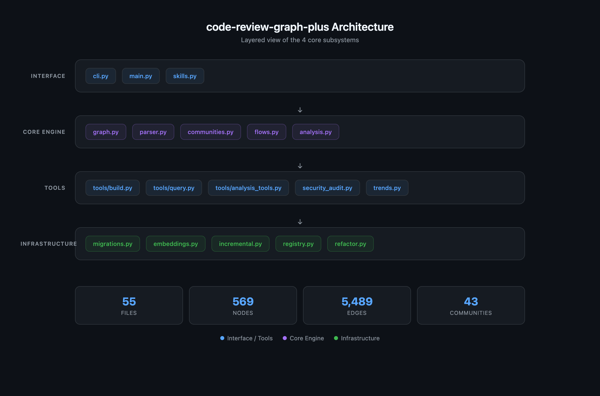

# code-review-graph-plus

[](https://www.python.org/)
[](LICENSE)
[](https://github.com/HaipingShi/code-review-graph-plus)

> 个人定制版 [code-review-graph](https://code-review-graph.com) v2.3.2，基于 AST 与调用关系构建代码知识图谱，提供 32+ MCP 工具用于架构分析、代码审查与安全审计。
>
> [English](README.md) | **中文**

---

## 与原版的区别

|特性|原版|本 fork|
|---|---|---|
| 架构分析 | 包含测试代码 | **仅分析生产代码**，排除测试节点与 `TESTED_BY` 边 |
| 技术债务追踪 | 无 | **趋势快照 + 阈值/趋势告警** |
| 安全数据流审计 | 无 | **敏感数据源/汇聚点识别 + 未保护路径追踪** |
| 社区命名 | 基础 | **增强停用词过滤 + 跨社区 Wiki 引用** |

> [!IMPORTANT]
> 测试代码仍保留在图谱中用于覆盖率报告，但不会出现在社区、热点、桥接点等架构指标中。这消除了"测试社区膨胀"和"跨社区边数虚高"的误报。

---

## 架构概览

基于真实构建结果的简洁层级视图（55 文件 / 569 节点 / 5,489 边 / 43 社区）：

[](docs/architecture-overview.html)

> 点击上方图片查看可交互版本。运行 `code-review-graph-plus visualize` 可生成本项目的完整交互式图谱。

---

## 快速开始

```bash
# 1. 安装 MCP 配置（自动识别 Claude/Cursor/Windsurf 等）
code-review-graph-plus install

# 2. 注册项目
cd /path/to/your-project
code-review-graph-plus register .

# 3. 构建图谱
code-review-graph-plus build

# 4. 查看状态
code-review-graph-plus status
```

---

## 安装

### 从 GitHub 安装

```bash
pip install "git+https://github.com/HaipingShi/code-review-graph-plus.git"
```

### 开发模式

```bash
git clone https://github.com/HaipingShi/code-review-graph-plus.git
cd code-review-graph-plus
pip install -e .
```

### 依赖

核心依赖会自动安装：`tree-sitter-language-pack`、`networkx`、`igraph`、`fastmcp`。如需语义搜索，额外安装 `sentence-transformers`。

---

## CLI 命令

| 命令 | 用途 |
|------|------|
| `install` / `init` | 注册 MCP 服务器到 AI 平台 |
| `build` | 完整构建（重新解析所有文件） |
| `update` | 增量更新（仅变更文件） |
| `postprocess` | 不重新解析，仅重跑流程/社区/全文检索 |
| `watch` | 监听文件变更自动更新 |
| `status` | 查看图谱统计 |
| `visualize` | 生成交互式 HTML 可视化 |
| `wiki` | 生成 Markdown Wiki |
| `register <path>` | 注册仓库到多仓库列表 |
| `unregister <path>` | 从列表移除 |
| `repos` | 列出已注册仓库 |
| `detect-changes` | 分析变更影响范围 |
| `serve` | 启动 MCP 服务器（stdio） |

---

## MCP 工具（32 个）

<details>
<summary>🏗️ 构建与探索（6 个）</summary>

- `build_or_update_graph` — 完整或增量构建
- `get_impact_radius` — 从变更文件计算影响范围
- `query_graph` — 图谱遍历（调用方、被调用方、导入等）
- `semantic_search_nodes` — 关键词 + 向量混合搜索
- `list_graph_stats` — 聚合统计
- `traverse_graph` — 带 Token 预算的 BFS/DFS 遍历

</details>

<details>
<summary>🔍 审查与变更分析（3 个）</summary>

- `get_review_context` — 聚焦子图 + 源代码片段
- `detect_changes` — 风险评分的变更影响分析
- `get_affected_flows` — 查找受变更影响的执行流

</details>

<details>
<summary>🏛️ 架构分析（9 个）</summary>

- `list_communities` — 检测到的代码社区
- `get_community` — 单个社区详情
- `get_architecture_overview` — 社区边界 + 耦合警告
- `list_flows` / `get_flow` — 按关键性排序的执行流
- `get_hub_nodes` — 连接最多的节点（热点）
- `get_bridge_nodes` — 架构瓶颈
- `get_knowledge_gaps` — 结构性弱点
- `get_surprising_connections` — 意外耦合
- `get_suggested_questions` — 自动生成的审查问题

</details>

<details>
<summary>🔧 重构辅助（3 个）</summary>

- `refactor` — 重命名预览、死代码检测、建议
- `apply_refactor` — 应用预览过的重构
- `find_large_functions` — 超大函数/类

</details>

<details>
<summary>📚 知识与搜索（5 个）</summary>

- `embed_graph` — 计算向量嵌入
- `generate_wiki` / `get_wiki_page` — 社区 Wiki
- `get_docs_section` — Token 优化的文档检索
- `cross_repo_search` — 跨仓库搜索

</details>

<details>
<summary>📈 趋势追踪（2 个）</summary>

- `get_debt_trends` — 架构健康度时间序列 + 告警
- `compare_snapshots` — 两次构建的详细对比

</details>

<details>
<summary>🛡️ 安全审计（4 个）</summary>

- `audit_security_flows` — 全面安全数据流审计
- `get_security_nodes` — 安全分类节点列表（源/汇聚/变换/检查）
- `get_unprotected_paths` — 查找敏感数据未保护路径
- `get_security_critical_flows` — 经过安全逻辑的执行流

</details>

---

## 功能详解

### 技术债务趋势追踪

每次 `build` 或 `postprocess` 后自动记录架构快照。支持：

- **时间序列趋势**：内聚度、耦合度、社区数量、大函数数量随时间变化
- **阈值告警**：指标越过阈值时即时告警（如内聚度 < 0.2）
- **趋势告警**：连续 3 次快照恶化时触发
- **快照对比**：任意两次构建的前后差异

```python
from code_review_graph.trends import get_trend_data, compute_alerts
from code_review_graph.tools._common import _get_store

store, _ = _get_store("/path/to/repo")
data = get_trend_data(store, "avg_cohesion", limit=20)
alerts = compute_alerts(store)
store.close()
```

### 安全数据流审计

基于关键词自动分类敏感数据源、汇聚点、安全变换和校验节点，追踪未保护路径：

```python
from code_review_graph.security_audit import audit_security_flows
from code_review_graph.tools._common import _get_store

store, _ = _get_store("/path/to/repo")
report = audit_security_flows(store)
print(f"Risk: {report['risk_level']} ({report['risk_score']})")
store.close()
```

> [!NOTE]
> 分类基于函数/类名中的关键词片段（如 `get_password`、`hash_password`、`log_request`），并通过 `_name_segments()` 分词避免 `login` 误匹配 `log` 等 false positive。

---

## 多仓库支持

注册多个仓库并在它们之间切换：

```bash
code-review-graph-plus register ~/projects/project-a
code-review-graph-plus register ~/projects/project-b
code-review-graph-plus repos
```

---

## 精确修改记录

从原版 v2.3.2 的变更详见 `MODIFICATIONS_*.diff`：

- `MODIFICATIONS_communities.diff` — 增强社区命名
- `MODIFICATIONS_wiki.diff` — 跨社区 Wiki 引用

---

## 许可证

MIT（与原版相同）。详见 [LICENSE](LICENSE)。
